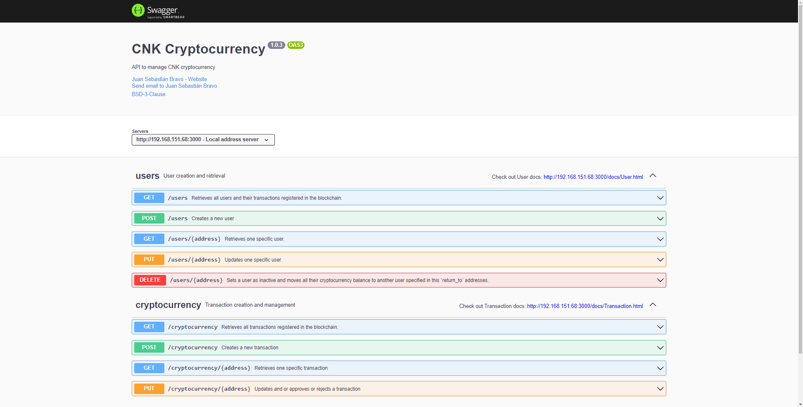
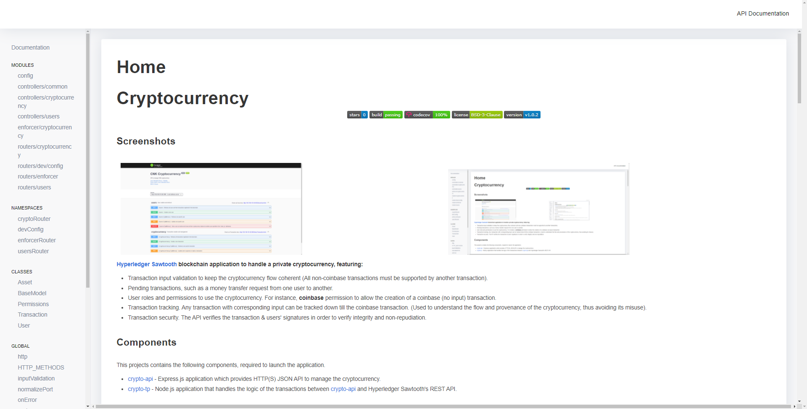

# Cryptocurrency

<div align="center">


[](https://github.com/jsbravoc/cryptocurrency/releases/)
[](https://codecov.io/gh/jsbravoc/cryptocurrency)


</div>

## Screenshots

<div align="center">

<table align="center">
  <tr>
    <td> </td>
    <td> </td>
    
   </tr> 
</table> 


</div>

**[Hyperledger Sawtooth](https://www.hyperledger.org/use/sawtooth) blockchain application to handle a private cryptocurrency, featuring:**

- Transaction input validation to keep the cryptocurrency flow coherent (All non-coinbase transactions must be supported by another transaction).
- Pending transactions, such as a money transfer request from one user to another.
- User roles and permissions to use the cryptocurrency. For instance, **coinbase** permission to allow the creation of a coinbase (no input) transaction.
- Transaction tracking. Any transaction with corresponding input can be tracked down till the coinbase transaction. (Used to understand the flow and provenance of the cryptocurrency, thus avoiding its misuse).
- Transaction security. The API verifies the transaction & users' signatures in order to verify integrity and non-repudiation. 


## Components

This projects contains the following components, required to launch the application.

- [crypto-api](https://github.com/jsbravoc/cryptocurrency/tree/main/build/app/backend) - Express.js application which provides HTTP(S) JSON API to manage the cryptocurrency.

- [crypto-tp](https://github.com/jsbravoc/cryptocurrency/tree/main/build/app/transaction_processor) - Node.js application that handles the logic of the transactions between [crypto-api](https://github.com/jsbravoc/cryptocurrency/tree/main/build/app/backend) and Hyperledger Sawtooth's REST API.

## Requirements

This project requires [git](https://www.git-scm.com), [Docker](https://www.docker.com/why-docker), [npm](https://www.npmjs.com/get-npm), and [Node.js](https://nodejs.org/en/) <=10.23.3*. 

\* Both `crypto-api` & `crypto-tp` projects use `sawtooth-sdk^1.0.5`, which internally uses `zeromq^4.2.1`. Unfortunately, `zeromq^4.2.1` breaks on Node.js 11+.


## Installation & Usage

This application uses [Docker](https://www.docker.com/why-docker), used to simplify the installation and deployment of the whole application. Although the application can be started by using Node.js (i.e `node index.js`), Sawtooth's components (the validator, the REST API, etc) are started using Docker directly.

### Alternative 1: Using Docker directly

In order to start the project using Docker, you will need to download the [docker-compose.yaml](https://raw.githubusercontent.com/jsbravoc/cryptocurrency/main/docker-compose.yaml) file available at the root of the repository. You can also clone the repository and access the document. 

```sh
git clone https://github.com/jsbravoc/cryptocurrency.git
cd cryptocurrency
```
#### 1) Starting the application

To start the whole application, you need to start the containers and dependencies of the docker-compose.yaml file, by executing:

```sh
docker-compose up #Use -d flag to start it detached
```
Then, the application will be started at the port mapped in the docker-compose.yaml file, by default `http://localhost:3000`.

#### 2) Stopping the application

To pause the execution of the application, you need to execute the following command:
```sh
docker-compose pause
```

Please note that if you paused the application on Docker, the correct way to start it up again is:
```sh
docker-compose unpause
```

Moreover, if you want to stop the project **and delete all of its contents**, you can execute:
```sh
docker-compose down
```

### Alternative 2: Cloning the project
#### 1) Downloading the project

In order to download the project and start it locally, you need to clone this repository and go to the root directory of the project:

```sh
git clone https://github.com/jsbravoc/cryptocurrency.git
cd cryptocurrency
```

#### 2) Starting up the application

Once Docker is installed and you've cloned this repo, navigate to the root directory of the project and run:

```sh
cd blockchain_network/docker-compose-dev/sawtooth
docker-compose up
```

Then, you need to install `transaction_processor` node dependencies and start it: 

```sh
cd build/app/transaction_processor
npm install
npm start # or pm2 start
```

Finally, you need to install `backend` node dependencies and start it: 

```sh
cd build/app/backend
npm install
npm start # or pm2 start if using PM2
```

Optionally, if you want to see the API definitions, make sure to go to `localhost:3000/api-docs` or to the URL of where the application was started.


#### 3) Stopping the application

In order to stop the application you need to send SIGINT to the running processes. Therefore, you should use `^C` (`Ctrl + C`) on the terminals running any component of the application. If you are using PM2, then run:
```sh
pm2 stop crypto-api
pm2 stop crypto-tp
```
To pause the blockchain network on Docker, execute the following command:
```sh
cd blockchain_network/docker-compose-dev/sawtooth
docker-compose pause
```

Please note that if you paused the blockchain network on Docker, the correct way to start it up again is:
```sh
cd blockchain_network/docker-compose-dev/sawtooth
docker-compose unpause
```

Moreover, if you want to stop the blockchain network **and delete all of its contents**, you can execute:
```sh
cd blockchain_network/docker-compose-dev/sawtooth
docker-compose down
```

## Development & Testing

### Front-end integration:

This application has been tested successfully with a front-end project that uses [Metamask](https://metamask.io/) in order to sign the transactions with the public/private key pair. However, if you want to use it without Metamask, be sure to read Metamask's signature implementation (namely Ethereum's `eth_sign` function) (See [getSignature function](https://github.com/jsbravoc/cryptocurrency/blob/main/src/app/backend/test/cryptocurrency.test.js#L77) in test/cryptocurrency) and sign the transactions in the same manner.

Recommended readings:
* [Metamask docs](https://docs.metamask.io/guide/signing-data.html#a-brief-history)
* [Metamask example usage](https://github.com/danfinlay/js-eth-personal-sign-examples)
* [Ethereum eth_sign explanation](https://eth.wiki/json-rpc/API) 
* [A closer look at ethereum signatures, by @dominiek](https://hackernoon.com/a-closer-look-at-ethereum-signatures-5784c14abecc)

### Development:

In order to understand the functions used inside the `backend` component, please access to `localhost:3000/docs` or to the URL of where the application was started. There you will find the JS documentation of all the code. 


### Testing:

**Recommendation:** Avoid integrity errors by editing .env file, setting `DISABLE_INTEGRITY_VALIDATION=true`. By doing this, the transaction's signature will not be validated. Note that if the variable is set to `false`, transactions' signatures **must** be verifiable with the corresponding user's public_key.

Also, if you want to test the application directly, please go to `localhost:3000/api-docs` or to the URL of where the application was started. There, you will find a [Swagger UI](https://swagger.io/tools/swagger-ui/) application to test the API and see the API definitions.


### Contributing:

In order to develop and contribute to this repository, make sure to run the tests of the API before creating a pull request:
#### 1) Start the blockchain network:

```sh
cd blockchain_network/docker-compose-dev/sawtooth
docker-compose up #Use -d flag to start it detached
```

#### 2) Start the transaction processor:

```sh
cd src/app/transaction_processor
npm start # or pm2 start if using PM2
```
#### 3) Run the tests:


```sh
cd src/app/backend
npm test
```

## Contributors
[Juan Sebastián Bravo](https://github.com/jsbravoc)


## License
BSD-3-Clause License © [Juan Sebastián Bravo](https://github.com/jsbravoc)

```
BSD 3-Clause License

Copyright (c) 2021, Juan Sebastián Bravo Castelo
All rights reserved.

Redistribution and use in source and binary forms, with or without
modification, are permitted provided that the following conditions are met:

1. Redistributions of source code must retain the above copyright notice, this
   list of conditions and the following disclaimer.

2. Redistributions in binary form must reproduce the above copyright notice,
   this list of conditions and the following disclaimer in the documentation
   and/or other materials provided with the distribution.

3. Neither the name of the copyright holder nor the names of its
   contributors may be used to endorse or promote products derived from
   this software without specific prior written permission.

THIS SOFTWARE IS PROVIDED BY THE COPYRIGHT HOLDERS AND CONTRIBUTORS "AS IS"
AND ANY EXPRESS OR IMPLIED WARRANTIES, INCLUDING, BUT NOT LIMITED TO, THE
IMPLIED WARRANTIES OF MERCHANTABILITY AND FITNESS FOR A PARTICULAR PURPOSE ARE
DISCLAIMED. IN NO EVENT SHALL THE COPYRIGHT HOLDER OR CONTRIBUTORS BE LIABLE
FOR ANY DIRECT, INDIRECT, INCIDENTAL, SPECIAL, EXEMPLARY, OR CONSEQUENTIAL
DAMAGES (INCLUDING, BUT NOT LIMITED TO, PROCUREMENT OF SUBSTITUTE GOODS OR
SERVICES; LOSS OF USE, DATA, OR PROFITS; OR BUSINESS INTERRUPTION) HOWEVER
CAUSED AND ON ANY THEORY OF LIABILITY, WHETHER IN CONTRACT, STRICT LIABILITY,
OR TORT (INCLUDING NEGLIGENCE OR OTHERWISE) ARISING IN ANY WAY OUT OF THE USE
OF THIS SOFTWARE, EVEN IF ADVISED OF THE POSSIBILITY OF SUCH DAMAGE.
```